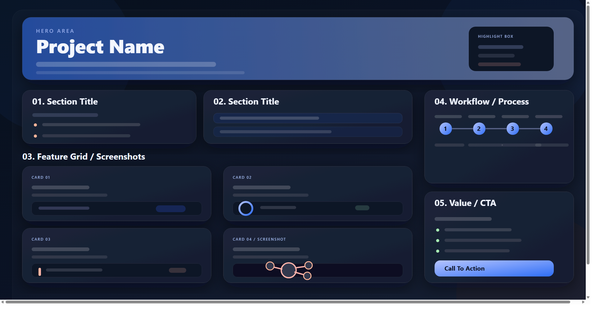

# RiskHub

> Read-only risk intelligence for crypto traders.

RiskHub helps crypto traders understand the risk behind their portfolio, not just the profit and loss number on screen. The platform connects to exchanges with read-only API access, aggregates live portfolio exposure, analyzes trading behavior, detects risky patterns, and prepares verifiable Web3 risk profiles for trader reputation.

RiskHub does not give buy/sell signals. It gives risk context.



## Why RiskHub?

Crypto traders often operate across multiple exchanges. Spot assets, futures positions, leverage, unrealized PnL, and behavioral risk are scattered across different interfaces. A trader can look profitable while quietly carrying excessive leverage, poor discipline, or dangerous drawdown exposure.

RiskHub is built to answer three questions:

- Where is my portfolio risk coming from?
- Am I trading with discipline or drifting into risky behavior?
- Can my trading reputation be verified with real data instead of screenshots?

## Core Features

### Unified Portfolio Dashboard

- Aggregates portfolio value across connected exchanges.
- Shows spot assets, USD valuation, open futures positions, leverage, entry price, mark price, and unrealized PnL.
- Tracks discipline score, max drawdown, net PnL, and data freshness.
- Includes a Portfolio Contagion Map to show how assets are connected by risk.

### Behavioral Quant Engine

RiskHub evaluates trading behavior over dynamic 30-day windows.

It currently detects:

- Revenge trading
- Overtrading
- Excessive leverage
- Max drawdown breaches
- Concentration risk

The engine computes metrics such as win rate, max drawdown, profit factor, Sharpe ratio, leverage statistics, net PnL, and a proprietary discipline score.

### Risk Analysis

- Breaks total risk into concentration, leverage, drawdown, and contagion components.
- Highlights top risk contributors instead of only showing a generic score.
- Supports scope filters such as all exchanges, Binance, and OKX.
- Supports mode filters such as spot, futures, and all.

### Real-Time Alerts

- Pushes alerts through WebSocket when important risk breaches occur.
- Stores alert history as an audit trail.
- Supports filtering by severity, category, rule, read state, exchange, date range, and search text.
- Links alerts back to related trades where available.

### Web3 Risk Identity

RiskHub turns risk analytics into a versioned Risk Profile.

A profile can include:

- Identity tier
- Discipline grade
- Risk level
- Leverage snapshot
- Drawdown snapshot
- Behavior flags
- Eligibility state

The current product includes SBT-ready profile generation and demo identity issuance. Production on-chain SBT minting is part of the roadmap.

## Product Philosophy

RiskHub is a mirror, not an autopilot.

It does not tell users what to buy, sell, open, or close. It surfaces the hidden risk behind portfolio performance so users can make their own decisions with better context.

Example: a trader may have strong PnL, but if leverage is high, drawdown is unstable, and discipline score is low, the profit may be coming from excessive risk instead of sustainable strategy.

## Tech Stack

### Frontend

- Next.js 14
- React 18
- TypeScript
- Tailwind CSS
- Framer Motion
- Lucide React
- Sonner
- XYFlow

### Backend

- FastAPI
- Motor / MongoDB
- Pydantic
- CCXT
- Pandas
- WebSockets
- AES-256-GCM credential encryption

## Project Structure

```text
RiskHub_v1.0/
|-- backend/
|   |-- api/                 # REST and WebSocket routers
|   |-- engine/              # Quant, risk, and correlation engines
|   |-- models/              # Pydantic / MongoDB document models
|   |-- services/            # Exchange, credential, and WebSocket services
|   |-- main.py              # FastAPI entrypoint
|   |-- database.py          # MongoDB lifecycle and indexes
|   `-- requirements.txt
|-- frontend/
|   |-- src/app/             # Next.js routes
|   |-- src/components/      # Dashboard, alerts, risk analysis, SBT UI
|   |-- src/hooks/           # Reusable frontend hooks
|   |-- src/lib/             # API clients and helpers
|   `-- package.json
|-- graphify-out/            # Knowledge graph output
`-- README.md
```

## Getting Started

### Prerequisites

- Python 3.12
- Node.js 20+
- MongoDB running locally or a MongoDB Atlas connection string
- Read-only Binance or OKX API keys for live exchange testing

### 1. Clone and enter the project

```powershell
git clone https://github.com/vukiet19/RiskHub_v1.0.git
cd RiskHub_v1.0
```

### 2. Configure the backend

```powershell
cd backend
py -3.12 -m venv venv
.\venv\Scripts\Activate.ps1
pip install -r requirements.txt
Copy-Item .env.example .env
```

Update `backend/.env`:

```env
MONGO_URL=mongodb://localhost:27017
MONGO_DB_NAME=riskhub
RISKHUB_ENCRYPTION_KEY=replace-this-with-a-real-secret
```

Start the API:

```powershell
uvicorn main:app --reload --host 0.0.0.0 --port 8000
```

Health check:

```text
http://localhost:8000/health
```

Optional demo seed:

```powershell
python seed_db.py
```

### 3. Configure the frontend

Open a new terminal:

```powershell
cd frontend
npm install
$env:NEXT_PUBLIC_API_BASE_URL="http://localhost:8000"
$env:NEXT_PUBLIC_RISKHUB_USER_ID="64f1a2b3c4d5e6f7a8b9c0d1"
npm run dev
```

Open:

```text
http://localhost:3000
```

## Main Screens

- `/dashboard` - live portfolio command center
- `/risk-analysis` - advanced risk decomposition and discipline analysis
- `/alert-history` - searchable alert audit trail
- `/sbt-identity` - Risk Profile and SBT-ready identity experience

## API Overview

| Area | Endpoint |
| --- | --- |
| Health | `GET /health` |
| Exchange keys | `GET /api/v1/exchange-keys/{user_id}` |
| Connect exchange | `POST /api/v1/exchange-keys/{user_id}/connect` |
| Dashboard overview | `GET /api/v1/dashboard/{user_id}/overview` |
| Dashboard refresh | `POST /api/v1/dashboard/{user_id}/refresh` |
| Risk analysis | `GET /api/v1/risk-analysis/{user_id}/overview` |
| Trigger engine | `POST /api/v1/engine/run/{user_id}` |
| Alert history | `GET /api/v1/dashboard/{user_id}/alerts/history` |
| SBT current profile | `GET /api/v1/sbt-identity/{user_id}/profile/current` |
| Save risk profile | `POST /api/v1/sbt-identity/{user_id}/profile/save` |
| Alert WebSocket | `ws://localhost:8000/ws/alerts/{user_id}` |

## Security Notes

- RiskHub is designed for read-only exchange access.
- It does not request custody, trading execution rights, transfer rights, or withdrawal permissions.
- Exchange credentials are encrypted at the application layer before being stored.
- Users should create exchange API keys with read-only permissions only.

## Roadmap

### Phase 1 - Production MVP

- Complete authentication and onboarding.
- Automate exchange sync and quant engine runs.
- Improve data freshness and user reporting exports.

### Phase 2 - True Web3 Identity

- Add Wallet Connect and SIWE.
- Deploy on-chain SBT minting.
- Build a public verification page for trader risk profiles.

### Phase 3 - Trust Infrastructure

- Provide APIs for copy-trading platforms.
- Launch shared community dashboards.
- Build a trader reputation graph based on verified risk profiles.

## Important Disclaimer

RiskHub is a risk analytics and reputation tool. It is not a financial advisor, trading bot, exchange, broker, or signal provider. All trading decisions remain the responsibility of the user.
